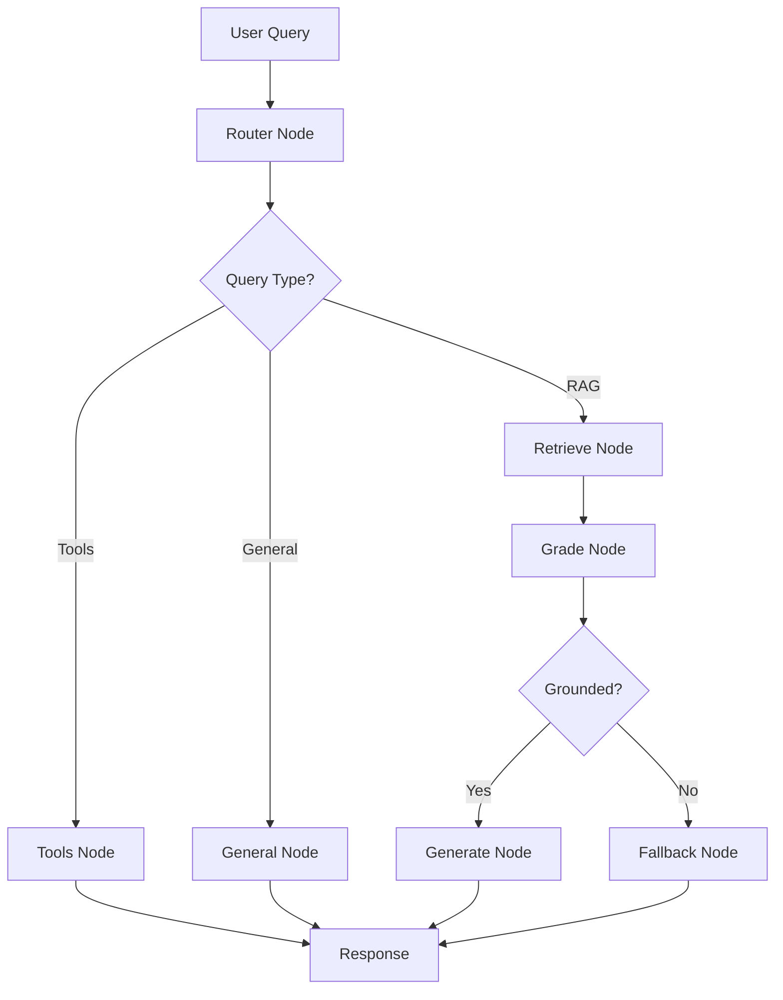

# 🔮 RAG Fortune Telling Chatbot

A sophisticated AI-powered fortune telling chatbot that combines Retrieval-Augmented Generation (RAG) with conversational memory and intelligent routing. The bot provides personalized horoscope readings based on zodiac signs and can answer general questions while maintaining conversation context.


## ✨ Features

### 🎯 Core Capabilities
- **Zodiac-Specific Readings**: Personalized horoscope content for all 12 zodiac signs
- **Intelligent Query Routing**: Automatically routes questions to appropriate handlers (Tools, General Knowledge, or RAG)
- **Advanced RAG Pipeline**: Multi-query retrieval with cross-encoder reranking for enhanced accuracy
- **Persistent Memory**: SQLite-based conversation history that persists across sessions
- **Real-time Tools**: Lucky number generator and current date/time functionality

### 🧠 AI Architecture
- **LangGraph Workflow**: State-based conversation flow management
- **Vector Search**: Pinecone vector database with semantic similarity search
- **Smart Filtering**: Content filtering by zodiac signs for targeted responses
- **Multiple LLM Support**: Compatible with Groq and Google Gemini models
- **Cross-Encoder Reranking**: Enhanced retrieval accuracy using BAAI/bge-reranker-base

### 💬 User Interface
- **Streamlit Web App**: Clean, interactive chat interface
- **Session Management**: Multiple conversation threads with unique session IDs
- **Memory Controls**: Clear chat history and reset session functionality
- **Real-time Status**: Live initialization and processing status updates

## 🚀 Quick Start

### Prerequisites
- Python 3.8+
- Pinecone API account
- Groq API account or Google AI API account

### Installation

1. **Clone the repository**
   ```bash
   git clone https://github.com/PSPritish/RAG_chatbot_app.git
   cd RAG_chatbot_app
   ```

2. **Install dependencies**
   ```bash
   pip install -r requirements.txt
   ```

3. **Set up environment variables**
   Create a `.env` file in the root directory:
   ```env
   PINECONE_API_KEY=your_pinecone_api_key
   GROQ_API_KEY=your_groq_api_key
   GOOGLE_API_KEY=your_google_api_key  # If using Google Gemini
   
   # Optional configurations
   MEMORY_DB_PATH=memory.db
   MEMORY_TABLE=message_store
   RERANKER_MODEL=BAAI/bge-reranker-base
   ```

4. **Prepare zodiac data**
   Ensure the `data/` directory contains zodiac sign text files:
   ```
   data/
   ├── aries.txt
   ├── taurus.txt
   ├── gemini.txt
   ├── cancer.txt
   ├── leo.txt
   ├── virgo.txt
   ├── libra.txt
   ├── scorpio.txt
   ├── sagittarius.txt
   ├── capricorn.txt
   ├── aquarius.txt
   └── pisces.txt
   ```

### Running the Application

#### Web Interface (Streamlit)
```bash
streamlit run app.py
```
Access the application at `http://localhost:8501`

#### Command Line Interface
```bash
python main.py
```

## 🏗️ Architecture

### System Components



### Data Flow

1. **Query Processing**: Input text is analyzed for intent and zodiac sign mentions
2. **Intelligent Routing**: Queries are routed to appropriate handlers:
   - **Tools**: Time/date queries, lucky number requests
   - **General**: Programming, factual questions, code requests
   - **RAG**: Zodiac-specific horoscope questions
3. **Vector Retrieval**: RAG queries trigger semantic search in Pinecone
4. **Content Filtering**: Results filtered by relevant zodiac signs
5. **Reranking**: Cross-encoder model reranks results for relevance
6. **Response Generation**: LLM generates contextual responses
7. **Memory Storage**: Conversation history saved to SQLite

### Key Technologies

- **Vector Database**: Pinecone for semantic search
- **Embeddings**: HuggingFace sentence-transformers (all-mpnet-base-v2)
- **LLMs**: Groq Llama 3.1 / Google Gemini 2.5
- **Framework**: LangChain + LangGraph for workflow orchestration
- **Memory**: SQLite with SQLAlchemy for persistence
- **Frontend**: Streamlit for web interface

## 🔧 Configuration

### Environment Variables

| Variable | Description | Default |
|----------|-------------|---------|
| `PINECONE_API_KEY` | Pinecone API key | Required |
| `GROQ_API_KEY` | Groq API key | Required |
| `GOOGLE_API_KEY` | Google AI API key | Optional |
| `MEMORY_DB_PATH` | SQLite database path | `memory.db` |
| `MEMORY_TABLE` | Database table name | `message_store` |
| `RERANKER_MODEL` | Cross-encoder model | `BAAI/bge-reranker-base` |

### Pinecone Setup

The application automatically creates a Pinecone index with these specifications:
- **Index Name**: `langchain-demo-signed-v2`
- **Dimension**: 768 (matching all-mpnet-base-v2)
- **Metric**: Cosine similarity
- **Cloud**: AWS (us-east-1)

## 📝 Usage Examples

### Zodiac Queries
```
"What can Aries expect this week?"
"Tell me about Scorpio's love life"
"Lucky number for Gemini"
```

### General Questions
```
"What is the capital of France?"
"How to create a Python function?"
"Explain machine learning"
```

### Tool Queries
```
"What's my lucky number?" 
"What time is it now?"
"Today's date"
```

## 🛠️ API Reference

### ChatBot Class

#### Initialization
```python
bot = ChatBot(
    index_name="your-index-name",
    cloud="aws",
    region="us-east-1"
)
```

#### Main Methods
```python
# Answer with conversation memory
response = bot.answer_with_graph(question, session_id="user123")

# Memory management
sessions = bot.list_sessions()
history = bot.get_history(session_id)
bot.clear_history(session_id)
bot.save_history(session_id, "backup.json")
bot.load_history(session_id, "backup.json")
```

## 📁 Project Structure

```
RAG_chatbot_app/
├── app.py                 # Streamlit web interface
├── main.py                # Core ChatBot class and CLI
├── requirements.txt       # Python dependencies
├── memory.db             # SQLite conversation history
├── memory_cli-user.json  # Example exported history
├── data/                 # Zodiac sign content
│   ├── aries.txt
│   ├── taurus.txt
│   └── ...
└── __pycache__/          # Python cache files
```

## 🚀 Deployment

### Render Deployment

This application can be deployed on Render with some considerations:

1. **Set environment variables** in Render dashboard
2. **Use PostgreSQL** instead of SQLite for persistence:
   ```python
   # Update connection string
   DATABASE_URL = os.getenv("DATABASE_URL")  # Render provides this
   ```
3. **Resource requirements**: The app uses ~1GB RAM due to ML models
4. **Start command**: `streamlit run app.py --server.port $PORT`

### Local Development
```bash
# Run with custom port
streamlit run app.py --server.port 8507

# Debug mode
streamlit run app.py --logger.level debug
```

## 🧪 Testing

### Manual Testing
```bash
# Test CLI interface
python main.py

# Test memory functions
python -c "
from main import ChatBot
bot = ChatBot()
print(bot.list_sessions())
"
```

### Example Queries for Testing
- Zodiac: "What's in store for Leo today?"
- Tools: "Give me my lucky number"
- General: "How to install Python packages?"
- Programming: "Show me a FastAPI example"

## 🤝 Contributing

1. Fork the repository
2. Create a feature branch (`git checkout -b feature/amazing-feature`)
3. Commit your changes (`git commit -m 'Add amazing feature'`)
4. Push to the branch (`git push origin feature/amazing-feature`)
5. Open a Pull Request

## 📄 License

This project is licensed under the MIT License - see the [LICENSE](LICENSE) file for details.

## 🙏 Acknowledgments

- **LangChain** for the RAG framework
- **Pinecone** for vector database services
- **HuggingFace** for embeddings and reranker models
- **Streamlit** for the web interface
- **Groq** and **Google** for LLM services

## 📞 Support

If you encounter any issues or have questions:

1. Check the [Issues](https://github.com/PSPritish/RAG_chatbot_app/issues) page
2. Create a new issue with detailed description
3. Include error logs and environment details

---

**Made with ❤️ and AI magic** ✨
